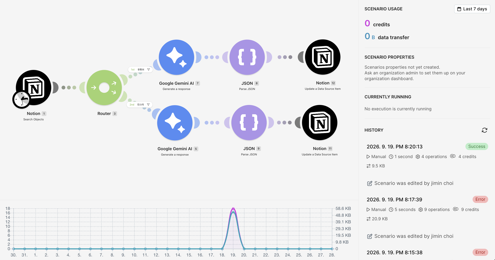
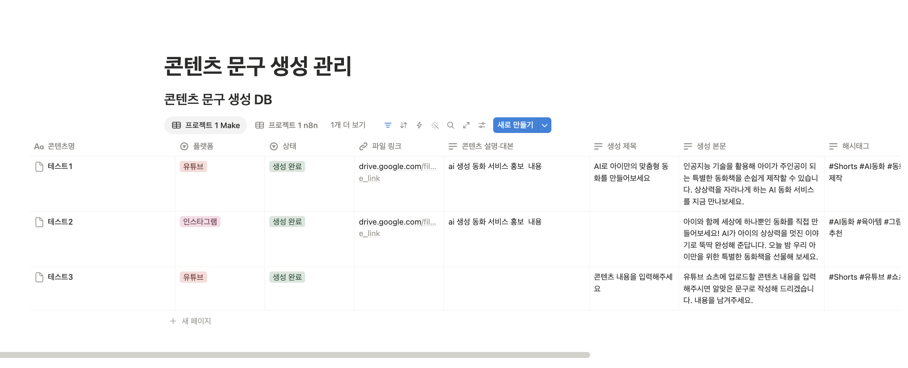
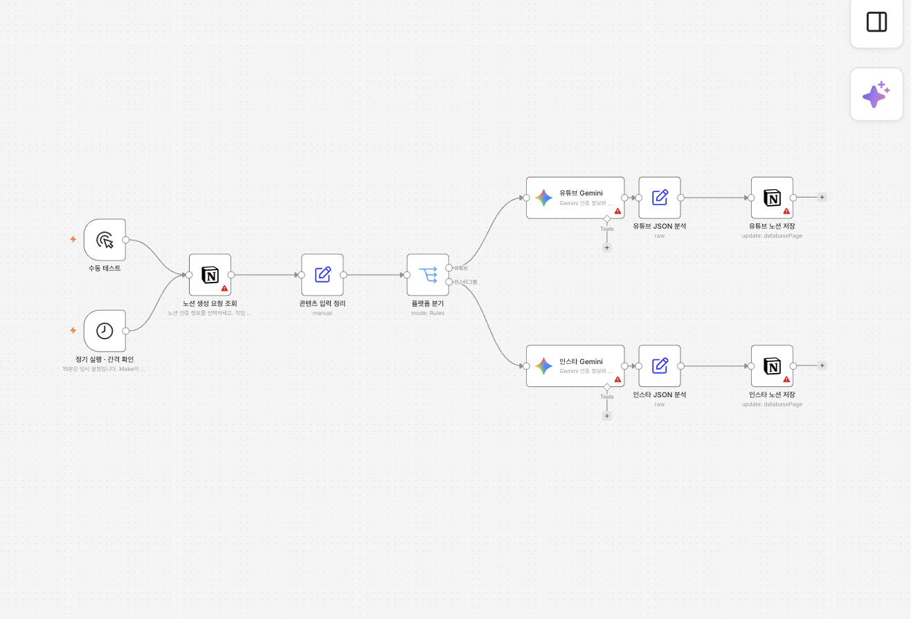
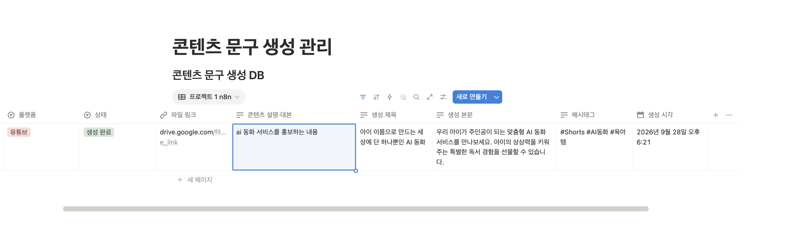

# 프로젝트 1 — 자동화 도구 비교 분석 보고서

**주제:** 유튜브 쇼츠·인스타그램 릴스 업로드 문구 생성 및 노션 저장 자동화  
**비교 도구:** Make Cloud / 로컬 n8n 2.40.7  
**작성일:** 2026년 9월 28일

> 검증 범위: Make와 n8n의 유튜브·인스타그램 결과를 모두 노션에서 확인했다. n8n은 실행 로그에서도 두 분기의 생성·분석·저장 성공을 확인했다. 본문은 확인된 결과와 별도로 확인이 필요한 비교 조건·제출 증거를 구분한다.

## 1. 자동화 목적과 업무 정의

콘텐츠를 게시할 때는 영상 설명을 바탕으로 플랫폼별 제목·본문·해시태그를 작성하고, 원본 파일과 함께 정리해야 한다. 같은 콘텐츠라도 유튜브 쇼츠는 제목과 설명이 필요하고, 인스타그램 릴스는 캡션 중심의 문구가 필요하다. 이 반복 작업을 자동화 대상으로 선정했다.

사용자는 원본 파일을 Google Drive에 보관하고, 노션에 파일 링크와 콘텐츠 설명·대본을 직접 입력한다. 자동화는 게시 플랫폼에 따라 Gemini에 다른 프롬프트를 전달하고, 생성 결과를 원래 노션 행에 저장한다. 영상 분석이나 실제 SNS 게시 기능은 구현 범위에 포함하지 않았다.

목표는 동일한 업무 흐름을 서로 다른 두 자동화 도구로 구현하고, 설정 과정·데이터 처리·오류 확인·운영 조건을 비교하는 것이다.

## 2. 공통 설계 및 비교 조건

### 2.1 공통 워크플로우

```text
정기 실행 또는 수동 테스트
        ↓
노션에서 작업 구분과 생성 요청 상태를 함께 조회
        ↓
플랫폼 조건 분기
        ├─ 유튜브 → Gemini → JSON 분석 → 노션 결과 저장
        └─ 인스타그램 → Gemini → JSON 분석 → 노션 결과 저장
```

| 구성 요소 | 역할 |
| --- | --- |
| Trigger | 설정한 일정 또는 테스트 실행으로 조회 시작 |
| 조회 조건 | 해당 도구의 작업 구분이면서 상태가 생성 요청인 항목 |
| 조건 분기 | 플랫폼이 유튜브인지 인스타그램인지 판단 |
| Action 1 | Gemini로 플랫폼별 문구 생성 |
| 데이터 처리 | 코드 블록 표시를 제거하고 JSON의 필드를 분리 |
| Action 2 | 원래 노션 행의 생성 결과·생성 시각·완료 상태 업데이트 |

노션 데이터베이스는 하나를 사용하고, `작업 구분`으로 Make와 n8n의 입력·결과를 분리했다. 각 도구가 자신의 요청만 조회하므로 서로 결과를 덮어쓰지 않도록 구성했다. `생성 완료` 항목은 다음 조회에서 제외한다. 이는 정상 완료 후 반복 처리를 줄이는 방식이며, 동시 실행에 대한 완전한 중복 방지까지 구현한 것은 아니다.

### 2.2 주요 데이터

| 구분 | 속성 |
| --- | --- |
| 사용자 입력 | 콘텐츠명, 플랫폼, 작업 구분, 파일 링크, 콘텐츠 설명·대본, 상태 |
| 자동화 출력 | 생성 제목, 생성 본문, 해시태그, 생성 시각, 상태 |
| 결과 형식 | 문자열 필드 title, body, hashtags를 가진 JSON 객체 |

Drive 파일 링크는 원본을 찾아보기 위한 정보이며, 자동화가 파일을 다운로드하거나 링크만으로 영상 내용을 이해하도록 구성하지 않았다. LLM의 입력은 사용자가 작성한 설명·대본이다.

### 2.3 비교 조건과 한계

- 두 도구는 같은 노션 DB 구조, 플랫폼 분기, Gemini 호출, JSON 처리, 원래 행 업데이트라는 업무 구조를 사용했다.
- n8n은 입력값을 정리하는 Edit Fields 노드를 추가했다. 도구별 내부 노드 수는 다르지만 처리 목적과 분기 구조는 같다.
- n8n 두 Gemini 노드의 설정 모델은 `models/gemini-flash-lite-latest`이며, 스케줄은 15분이다.
- 결과 캡처의 설명 입력은 Make에서 “ai 생성 동화 서비스 홍보 내용”, n8n에서 “ai 동화 서비스를 홍보하는 내용”으로, 주제는 같지만 문장이 완전히 같지는 않다. 생성 문구의 차이만으로 도구별 품질 우열을 판단하지 않는다.
- Make의 최종 모델명과 실제 활성 일정은 이번 보고서 작성 시 직접 확인하지 못했다. 따라서 모델·실행 주기가 완전히 동일한 조건의 성능 실험이라고 주장하지 않는다.
- `latest` 모델 별칭은 시점에 따라 대상 모델이 달라질 수 있으므로, 재현 실험에서는 구체적인 모델 버전과 설정을 기록하는 것이 좋다.
- 실행 시간·구현 시간·생성 품질을 같은 조건에서 반복 측정하지 않았다. 이번 비교는 기능 구현과 운영 경험을 중심으로 한다.
- n8n은 준비된 워크플로우 JSON을 가져온 뒤 인증과 테스트를 진행했다. Make의 수동 구성과 작업 출발점이 다르므로, 클릭 수나 총 구현 시간만으로 도구의 난이도를 단정하지 않는다.

## 3. 도구별 구현 과정

### 3.1 Make

1. 클라우드 계정을 만들고 Scenario를 생성했다.
2. Notion 연결에 콘텐츠 DB 접근 권한을 부여했다.
3. Search Objects에서 Data Source Items를 대상으로 작업 구분과 상태 조건을 설정했다.
4. Router를 추가하고 플랫폼별 필터를 구성했다.
5. 두 경로에 Google Gemini AI 모듈을 배치하고 짧은 쇼츠·릴스 프롬프트를 설정했다.
6. Parse JSON으로 title, body, hashtags를 분리했다.
7. Update a Data Source Item에서 조회 결과의 Page ID를 사용해 원래 행을 업데이트했다.
8. 모듈별 실행 결과와 노션에 저장된 문구를 확인했다.

Make에서는 연결선에 필터를 붙여 경로를 나눌 수 있었다. 반면 데이터 소스와 데이터베이스 ID, 속성 객체와 실제 문자열 값 등 데이터 구조를 구분해야 하는 단계에서 확인 작업이 필요했다.

### 3.2 로컬 n8n

1. Docker로 n8n 2.40.7을 실행하고 영구 데이터 볼륨을 구성했다.
2. 로컬 소유자 계정을 설정하고 준비한 워크플로우를 가져왔다.
3. Notion과 Gemini 인증 정보를 각 노드에 연결했다.
4. Notion Get Many에서 작업 구분이 프로젝트 1 n8n이고 상태가 생성 요청인 행을 조회했다.
5. Edit Fields에서 페이지 ID, 플랫폼명, 콘텐츠 설명을 정리했다.
6. Switch에서 유튜브와 인스타그램 경로를 나누고 각 Gemini 노드에 프롬프트를 적용했다.
7. Edit Fields의 표현식으로 코드 블록을 제거하고 JSON을 분석했다.
8. Notion Update에서 입력 행과 연결된 Page ID를 사용해 결과를 저장했다.

독립된 프로그램 코드를 작성해 실행하는 Code 노드는 사용하지 않았지만, JSON 처리와 텍스트 추출에는 JavaScript 표현식을 사용했다. 따라서 모든 설정을 클릭만으로 처리한 구현은 아니다.

로컬 실행에서는 브라우저 편집 화면 외에도 Docker 실행 상태, 데이터 저장 위치, 컴퓨터 가동 여부를 관리해야 했다.

## 4. 실행 결과 및 검증

### 4.1 확인된 결과

| 도구 | 분기 | 결과 | 확인 근거 |
| --- | --- | --- | --- |
| Make | 유튜브 | 생성 제목·본문·해시태그 존재, 생성 완료 | 현재 노션 DB에서 확인; 사용자가 Make 구현 완료 확인 |
| Make | 인스타그램 | 생성 본문·해시태그 존재, 생성 완료 | 현재 노션 DB에서 확인; 인스타 제목은 비워두는 설계 |
| n8n | 유튜브 | 조회·분기·Gemini·JSON 분석·노션 저장 성공 | 실행 ID 4 및 현재 노션 DB |
| n8n | 인스타그램 | 조회·분기·Gemini·JSON 분석·노션 저장 성공, 본문·해시태그 저장 및 생성 완료 | 실행 ID 5 및 현재 노션 DB |

노션의 현재 저장 결과와 첨부된 화면을 결과 확인 근거로 사용했다. Make 구성 화면 오른쪽에는 2026년 9월 19일 오후 8:20:13의 Success 이력이 보인다. 이력 요약만으로 그 실행에서 어느 분기를 처리했는지는 확정하지 않고, 두 플랫폼 결과는 노션 저장 화면으로 확인했다. n8n 결과 캡처는 유튜브만 표시하며, 인스타그램 성공은 별도로 조회한 실행 ID 5와 노션 DB로 확인했다.

### 4.2 n8n 실행 로그

2026년 9월 28일 18:21:10(KST)에 시작된 수동 실행 ID 4에서 다음 흐름을 확인했다.

| 단계 | 처리 결과 |
| --- | --- |
| 노션 조회 | 조건에 맞는 행 1개 반환 |
| 플랫폼 분기 | 유튜브 1개 / 인스타그램 0개 |
| 유튜브 Gemini | 성공, 출력 1개 |
| 유튜브 JSON 분석 | 성공, 출력 1개 |
| 유튜브 노션 저장 | 성공, 출력 1개 |

2026년 9월 28일 18:23:39(KST)에 시작된 수동 실행 ID 5에서는 인스타그램 경로를 확인했다.

| 단계 | 처리 결과 |
| --- | --- |
| 노션 조회 | 조건에 맞는 행 1개 반환 |
| 플랫폼 분기 | 유튜브 0개 / 인스타그램 1개 |
| 인스타 Gemini | 성공, 출력 1개 |
| 인스타 JSON 분석 | 성공, 출력 1개 |
| 인스타 노션 저장 | 성공, 출력 1개 |

두 실행을 통해 n8n의 각 분기가 실제로 최소 1회 동작했음을 확인했다. 노션에서도 두 플랫폼 모두 생성 본문과 해시태그가 저장되고 상태가 생성 완료로 변경된 것을 확인했다.

앞선 실행 ID 2와 3은 전체 상태가 success였지만 조회 결과가 0개였으므로 Gemini와 저장 노드는 실행되지 않았다. 이를 통해 실행 성공 표시와 업무 처리 완료는 별개이며, 각 단계의 출력 개수와 최종 저장 결과까지 확인해야 함을 알 수 있었다.

현재 확인한 성공 로그는 수동 테스트다. 스케줄 설정이 존재하는 것과 정해진 시간에 자동 실행된 것을 구분해야 하며, 자동 실행 성공은 별도 기록으로 검증해야 한다.

## 5. 비교 분석

아래 평가는 이번 구현에서 확인한 사용 경험을 중심으로 작성했다. 요금·제공 범위는 2026년 9월 28일 공식 자료를 확인했다.

| 비교 항목 | Make Cloud | 로컬 n8n | 분석 |
| --- | --- | --- | --- |
| 시작 환경 | 계정 생성 후 브라우저에서 구성 | Docker 실행, 저장 볼륨, 로컬 계정 설정 | 설치 부담은 Make가 적었다. n8n은 환경 관리가 추가된다. |
| 화면과 흐름 파악 | 원형 모듈과 연결선으로 구성, Router로 분기 | 노드와 Switch의 출력 경로로 구성 | 두 도구 모두 흐름을 시각적으로 표현할 수 있었다. |
| 서비스 인증 | Notion Public 연결과 Gemini API 키 사용 | 노드용 Credentials에 Notion·Gemini 인증 연결 | 두 도구 모두 인증과 페이지 접근 권한을 별도로 설정해야 했다. |
| 조건 분기 | Router 연결선에 플랫폼 필터 설정 | Switch에 플랫폼별 규칙 설정 | 값이 정확히 일치해야 하므로 선택값 표기를 통일하는 것이 중요했다. |
| 데이터 매핑 | 출력 목록에서 토큰을 선택해 입력란에 연결 | 노드 출력과 표현식으로 필드 연결 | Make는 시각적 선택이 중심이고, 이번 n8n 구성은 표현식 활용 비중이 더 컸다. |
| JSON 처리 | Parse JSON 모듈과 replace·trim 함수 | Edit Fields의 JSON.parse·문자열 처리 표현식 | 두 도구 모두 LLM 출력의 코드 블록 제거가 필요했다. n8n 표현식은 유연하지만 문법 이해가 필요하다. |
| 오류 확인 | Operation의 Input/Output, Filter inspector 확인 | 실행별 노드 상태와 입출력 개수 확인 | 전체 성공 여부보다 어느 단계에서 출력이 끊겼는지를 보는 방식이 효과적이었다. |
| 연동 서비스 | 이번에 Notion·Gemini 연결 사용 | 이번에 Notion·Gemini 기본 노드 사용 | 필요한 두 서비스는 모두 지원했다. 전체 서비스 수만으로 우열을 판단하지 않았다. |
| 무료 범위·비용 | 공식 Free 기준 월 1,000 credits, 최소 15분 간격 [1] | Community Edition을 로컬에서 사용; 장비·전력·운영 부담 별도 [2] | Make는 사용량 한도를, 로컬 n8n은 실행 자원과 운영 부담을 고려해야 한다. |
| 유지 관리 | 실행 서버를 서비스가 관리 | 컴퓨터·Docker 가동, 저장 공간과 업데이트를 직접 관리 | 상시 운영 편의성은 Make가 유리하고, 로컬 환경 제어는 n8n이 유리했다. |
| 공유·재현 | 시나리오 구성과 연결 정보를 구분해 전달 필요 | 워크플로우 JSON과 실행 설정을 함께 전달 가능 | 공유받은 사람은 자신의 인증과 DB를 연결해야 한다. |

### 비용 해석

Make의 조회 모듈 실행 화면에는 1 operation, 1 credit가 표시됐다. 추가로 그림 1의 성공 실행 이력에는 4 operations, 4 credits가 표시된다. 두 기록은 확인 범위가 다르며, 입력 개수와 실행 경로를 통제한 측정이 아니므로 이를 일반적인 콘텐츠 건당 비용으로 해석하지 않았다.

15분마다 30일 동안 실행하면 조회 주기는 2,880회다. 매 조회가 1 credit를 사용하는 조건이라면 조회만으로도 Free의 월 1,000 credits를 넘을 수 있다. 따라서 무료 과제 테스트와 한 달 내내 상시 운영하는 상황을 구분하고, 실제 실행 내역에 따라 간격을 조절해야 한다. 이 수치는 가정에 따른 계산이며 실제 월간 청구액을 측정한 결과가 아니다. [1]

Gemini는 무료 제공 모델과 사용 한도가 있으므로, 자동화 도구 비용과 별도로 API 프로젝트의 요금 등급과 사용량을 확인해야 한다. 본 과제는 Gemini 무료 API 사용을 목표로 했으나 실제 청구 내역은 검증하지 않았다. [3]

## 6. 발생한 문제와 해결 과정

| 문제 | 확인한 원인 | 조치·교훈 |
| --- | --- | --- |
| Make에서 Notion 404 | Database (Legacy) 설정에 Data Source ID 입력 | Data Source 방식으로 변경. 저장 대상은 조회 결과의 Page ID로 연결 |
| 인스타 경로에서 모든 항목 차단 | 필터 비교값은 인스타, DB 선택값은 인스타그램 | 비교 문자열 통일 및 플랫폼의 Name 값을 선택하도록 수정 |
| Source is not valid JSON | Gemini가 JSON 앞뒤에 마크다운 코드 블록 추가 | 분석 전 코드 블록과 공백을 제거하도록 처리 |
| 필수 입력과 실행 일정 충돌 | 시나리오 입력이 Required인 상태에서 정기 일정 사용 | 노션 조회 방식에 불필요한 필수 입력 설정 해제 |
| n8n에서 성공 표시인데 결과 없음 | 노션 조회 조건에 맞는 행이 0개 | 작업 구분과 생성 요청 상태를 맞춘 뒤 재실행; 이후 유튜브 처리 성공 확인 |
| Gemini 키 입력 위치 혼동 | 워크플로우 노드 대신 Assistant의 OpenRouter 설정창 사용 | Gemini 노드용 인증 설정으로 이동해 연결 |

이 과정에서 도구 조작뿐 아니라 ID의 종류, 데이터 타입, 정확한 필터 값, LLM 출력 형식을 이해하는 것이 중요했다. 특히 정상 종료라는 표시만으로 작업 완료를 판단하지 않고 최종 노션 데이터까지 확인했다.

## 7. 장단점 및 적합한 사용 상황

### Make

**장점:** 설치 없이 브라우저에서 시작할 수 있고, Router와 필터를 이용해 분기를 시각적으로 구성하기 편했다. 로컬 컴퓨터를 계속 켜둘 필요 없이 서비스에서 실행 환경을 관리한다.

**단점:** 모듈 사용량과 실행 주기를 고려해야 한다. 이번 구현에서는 Notion의 Legacy/Data Source 구분과 출력 토큰 선택을 이해하는 데 확인 작업이 필요했다.

**적합한 상황:** 서버 관리 경험이 적고, 지원되는 앱들을 연결해 반복 업무를 빠르게 구성하려는 개인·팀. 사용량이 요금제 범위에 맞고 클라우드 운영 편의성이 중요한 경우.

### 로컬 n8n

**장점:** 실행 환경과 데이터를 직접 관리하고 워크플로우 파일을 재사용할 수 있었다. 입력값 정리, 조건 분기, JSON 변환을 노드와 표현식으로 명시적으로 구성할 수 있었다.

**단점:** 설치·업데이트·가동 상태를 직접 관리해야 한다. 이번 구성에서는 표현식 문법과 Credentials 구조를 이해해야 했으며, 컴퓨터가 꺼지면 로컬 자동화도 실행되지 않는다.

**적합한 상황:** Docker나 로컬 개발 환경을 사용할 수 있고, 실행 구조를 학습하거나 향후 데이터 처리와 API 연동을 확장하려는 경우. 운영 책임을 감수하면서 환경을 직접 제어하고 싶은 경우.

### 선택 의견

이번 비교를 통해 두 도구 모두 같은 콘텐츠 문구 생성 업무를 표현할 수 있음을 확인했다. 빠른 클라우드 구성과 운영 편의성에는 Make가 적합했고, 환경 제어와 후속 확장 학습에는 로컬 n8n이 적합했다. 프로젝트 2에서는 이미 준비한 로컬 n8n을 재사용하되, 일정 실행과 오류 처리 검증을 보완할 계획이다.

## 8. 구성 화면과 실행 결과

제공된 원본 캡처 4개를 첨부했다. 이미지에 보이는 상태와 실행 로그로 확인한 사실을 구분해 설명한다.

### 그림 1. Make 워크플로우 및 실행 이력



Notion 조회 이후 Router에서 유튜브·인스타 경로로 분기하고, 각 경로에서 Gemini → Parse JSON → Notion 업데이트를 수행한다. 오른쪽 History에 2026년 9월 19일 오후 8:20:13의 Success 기록과 4 operations, 4 credits가 표시된다. 이전 Error 기록도 남아 있어 오류 수정 후 성공 실행에 도달한 과정을 확인할 수 있다. 상단 사용량은 Last 7 days 범위이므로 과거 이력의 크레딧과 구분한다.

### 그림 2. Make의 노션 저장 결과



프로젝트 1 Make 보기의 테스트1(유튜브)과 테스트2(인스타그램)에 생성 문구와 해시태그가 저장되어 있고, 상태는 모두 생성 완료다. 인스타그램은 제목을 비워두는 설계다.

테스트3은 콘텐츠 설명이 비어 있는데도 입력을 요청하는 답변이 저장되고 상태가 생성 완료로 변경되어 있다. 이 행은 정상 문구 생성 사례에서 제외했다. 입력이 비어 있으면 LLM 호출 전에 중단하거나 보완 요청 상태로 보내는 검증이 필요하다는 한계를 보여준다. 테스트1·2의 짧은 설명보다 구체적인 기능을 언급하는 출력도 있어, 사실 일치 여부의 검토는 별도로 필요하다.

### 그림 3. n8n 워크플로우 구성



수동 테스트·정기 실행 Trigger, 노션 조회, 입력 정리, Switch 분기와 플랫폼별 Gemini·JSON 분석·노션 저장 노드가 연결되어 있다. 제공된 구성 캡처에는 일부 노드에 인증·설정 관련 경고 표시가 남아 있다. 이 이미지는 흐름 구조의 증거로 사용하고, 최종 실행 성공은 4.2절의 실행 ID 4·5와 결과 데이터로 확인했다. 최종 연결 상태를 보여주려면 최신 화면으로 교체하는 것이 좋다.

### 그림 4. n8n의 유튜브 문구 저장 결과



프로젝트 1 n8n 보기에서 유튜브의 생성 제목·본문·해시태그와 생성 완료 상태를 확인할 수 있다. 생성 시각은 2026년 9월 28일 오후 6:21로, 실행 ID 4의 시각과 일치한다. 이 캡처에는 인스타그램 행이 보이지 않는다. 인스타그램은 실행 ID 5의 성공과 DB 저장 결과를 별도로 확인했으며, 그 행이 보이는 캡처를 추가하면 분기별 증거가 완성된다.

### 제출 전 확인

- [x] n8n 유튜브·인스타그램 경로를 각각 실행하고 결과를 확인했다. (실행 ID 4·5)
- [x] 두 도구의 구성 화면과 제공된 결과 화면 4개를 보고서에 첨부했다.
- [x] 제공 이미지에서 API 키·토큰·비밀번호·이메일 노출이 없는지 확인했다. Make 이력의 편집자 이름은 원본에 표시되어 있다.
- [x] 이미지의 경고 표시·누락된 행·입력 검증 한계를 본문에 반영했다.
- [ ] n8n 인스타그램 결과 행이 보이는 캡처를 추가한다.
- [ ] Make의 최종 모델명·실행 간격을 기록하고 비교 조건의 차이를 명시한다.

## 참고 자료

- 과제 원문: 「미션 - AI 도구 학습.pdf」, 2~4쪽의 산출물·공통 기능·프로젝트 1 요구사항.
- [1] [Make 요금제](https://www.make.com/en/pricing), 2026-09-28 확인.
- [2] [n8n 요금제 및 Community Edition 안내](https://n8n.io/pricing/), 2026-09-28 확인. 본 보고서의 n8n 비교 대상은 Cloud 요금제가 아닌 로컬 실행 환경이다.
- [3] [Gemini API 요금·무료 범위](https://ai.google.dev/gemini-api/docs/pricing), 2026-09-28 확인.
- [4] [Make Notion 연결·모듈 안내](https://apps.make.com/notion), 2026-09-28 확인.
- 실증 자료: 프로젝트 폴더의 Make·n8n 구성/결과 캡처 4개, 대화에서 제공된 Make 실행·오류 화면, 과제용 노션 DB의 저장 결과, 로컬 n8n 실행 ID 1~5 및 실행 당시 워크플로우 설정.
