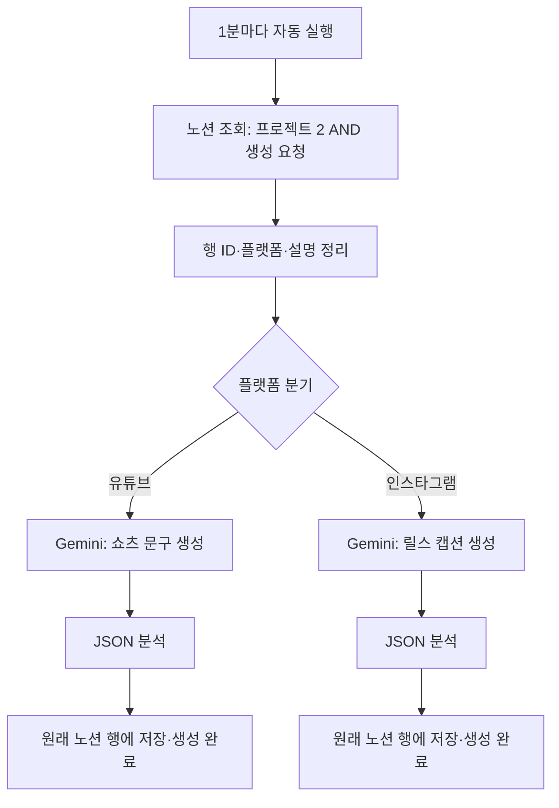
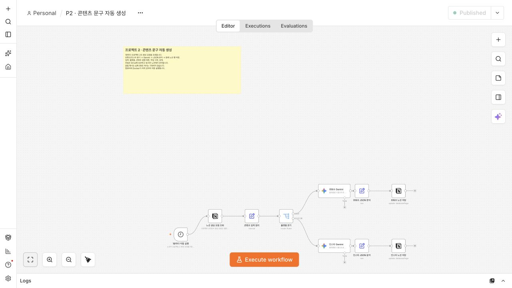
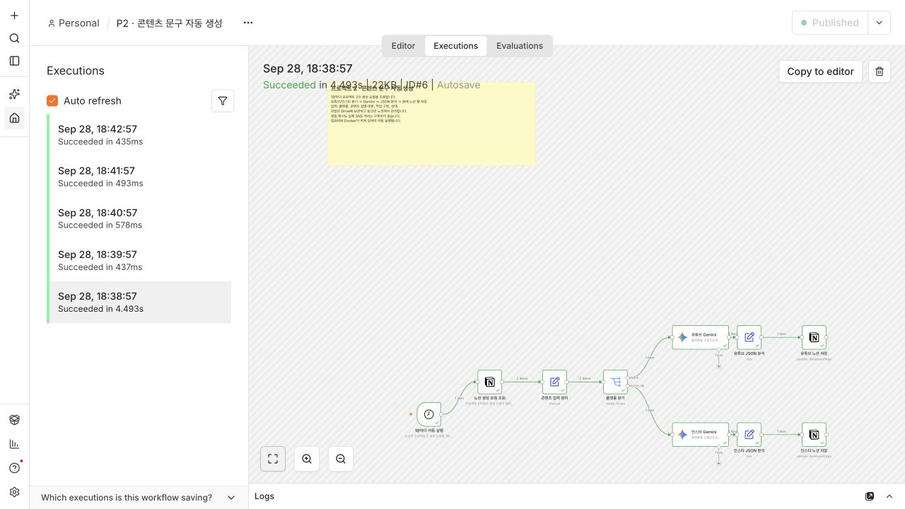
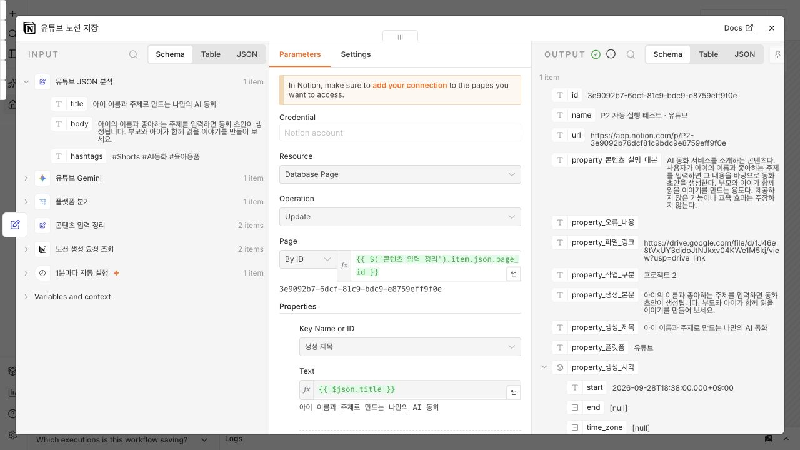
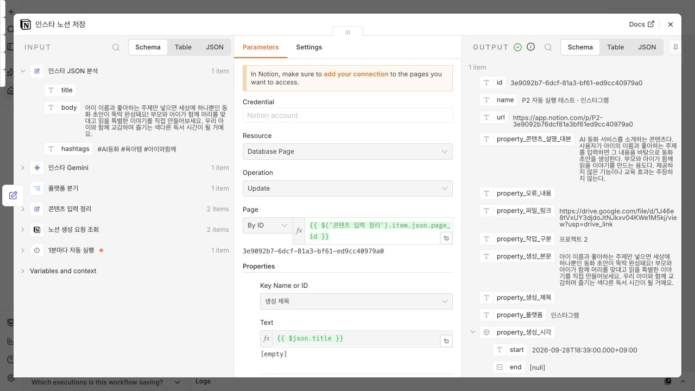

# 프로젝트 2 — 콘텐츠 문구 자동 생성 설계 및 구현

작성일: 2026-09-28 · 구현 도구: 로컬 n8n 2.40.7 · 필수 과제 범위

## 1. 자동화할 반복 작업과 목표

콘텐츠를 올릴 때마다 설명을 읽고 유튜브 쇼츠 제목·설명·해시태그 또는 인스타그램 릴스 캡션·해시태그를 작성하고 노션에 옮기는 작업을 자동화했다. 사용자는 노션에 콘텐츠 설명과 플랫폼을 입력하고 상태를 ‘생성 요청’으로 바꾼다. n8n이 정기적으로 요청을 찾아 Gemini로 문구를 생성하고 원래 행에 저장한다.

실제 SNS 게시, 별도 알림, 실패 알림 및 재시도 기능은 포함하지 않았다. Gemini는 선택한 주제의 문구 생성에 사용하며 별도의 보너스 기능을 추가하지 않았다. 파일은 Google Drive에 보관하고 노션에는 링크만 기록한다. 이 구현은 파일 자체를 읽거나 영상 내용을 분석하지 않으며, 사용자가 작성한 설명·대본을 입력으로 사용한다.

## 2. 도구 선정 이유

프로젝트 1에서 검증한 n8n 흐름과 Notion·Gemini 인증을 재사용할 수 있어 n8n을 선택했다. 조회, 조건 분기, 문구 생성, 결과 저장을 하나의 화면에서 확인할 수 있고, 로컬 Docker로 실행해 워크플로우를 JSON으로 보관할 수 있다. 대신 컴퓨터와 Docker가 실행 중이어야 예약 작업이 동작한다. Gemini와 Notion은 외부 서비스를 사용하므로 인터넷 연결과 각 서비스의 사용 한도가 필요하다.

프로젝트 1은 두 도구의 동일 기능 비교였고, 프로젝트 2는 같은 반복 업무를 독립적인 정기 실행 워크플로우로 운영하도록 구성했다. 별도 워크플로우와 ‘작업 구분 = 프로젝트 2’ 필터를 사용한다.

## 3. 데이터와 처리 흐름

| 구분 | 노션 속성 | 사용 방법 |
|---|---|---|
| 입력 | 콘텐츠명 | 사용자가 정하는 관리용 이름 |
| 입력 | 작업 구분 | 프로젝트 2 |
| 입력 | 플랫폼 | 유튜브 또는 인스타그램 |
| 입력 | 콘텐츠 설명·대본 | 문구 생성의 근거가 되는 내용 |
| 참고 | 파일 링크 | Drive 원본 링크, 자동 분석에는 사용하지 않음 |
| 처리 조건 | 상태 | 생성 요청인 행만 처리 |
| 출력 | 생성 제목 | 유튜브 제목, 인스타그램은 빈 문자열 |
| 출력 | 생성 본문 / 해시태그 | 플랫폼별 문구 |
| 출력 | 상태 / 생성 시각 | 생성 완료와 처리 시각 |

1. Schedule Trigger가 1분마다 시작한다.
2. Notion에서 작업 구분이 프로젝트 2이고 상태가 생성 요청인 행을 최대 10개 조회한다.
3. 각 행의 페이지 ID, 플랫폼, 설명을 추출한다.
4. Switch가 유튜브와 인스타그램을 구분한다.
5. 각 분기의 Gemini가 다른 프롬프트로 문자열 필드 `title`, `body`, `hashtags`를 생성한다.
6. JSON 앞뒤에 코드 블록 표시가 붙으면 제거한 뒤 분석한다.
7. 처음 조회한 페이지 ID로 해당 행을 갱신하고 상태를 생성 완료로 바꾼다. 새 페이지를 생성하지 않는다.

조회할 요청이 없으면 뒤의 문구 생성·저장 단계로 전달되는 항목이 없다. 정상적으로 완료된 행은 다음 조회의 ‘생성 요청’ 조건에서 제외된다. 플랫폼은 지정된 두 선택지만 사용해야 한다.

## 4. 구현 설정

- 워크플로우: `P2 · 콘텐츠 문구 자동 생성`
- 실행 환경: 로컬 Docker, n8n 2.40.7, 시간대 Asia/Seoul
- 자동 실행 간격: 1분
- Gemini 모델 설정: `models/gemini-flash-lite-latest` — 실행 당시 사용한 별칭이며 향후 같은 별칭의 실제 모델은 달라질 수 있다.
- 인증: n8n Credentials에 저장한 Notion 및 Google Gemini 인증 연결
- 공유용 JSON: 인증 참조와 키를 제외하고 비활성 상태로 제공

유튜브 프롬프트는 제목 35자 이내, 설명 2문장 이내, #Shorts 포함 해시태그 3개를 요청한다. 인스타그램 프롬프트는 관심을 끄는 첫 문장, 친근한 말투의 3문장 이내 캡션, 해시태그 3개와 빈 제목을 요청한다. 두 프롬프트 모두 제공하지 않은 사실을 만들지 않도록 지시한다. 길이와 사실 여부는 프롬프트 지시이며 별도 자동 검증 단계는 없다.

### 실제 구현 화면

## 5. 자동 실행 검증

서로 다른 플랫폼의 테스트 행 2개를 ‘생성 요청’으로 등록한 뒤 예약 실행으로 처리했다. 수동 실행 버튼으로 만든 결과가 아니다.

| 항목 | 확인 결과 |
|---|---|
| 실행 ID | 6 |
| 실행 방식 | trigger — 예약 트리거 |
| 시작 | 2026-09-28 18:38:57.054 KST |
| 종료 | 2026-09-28 18:39:01.547 KST |
| 소요 시간 | 4.493초, 이번 1회 측정값 |
| 노션 조회 | 2개 항목 |
| 유튜브 분기 | 1개, Gemini·JSON 분석·노션 저장 성공 |
| 인스타그램 분기 | 1개, Gemini·JSON 분석·노션 저장 성공 |
| 노션 재조회 | 두 행 모두 생성 완료 및 문구 저장 확인 |

### 유튜브 결과

### 인스타그램 결과

인스타그램 제목이 비어 있는 것은 프롬프트에서 지정한 동작이다. 캡션과 해시태그는 정상 저장됐다. 노션 생성 시각은 분 단위 값으로 저장되어 실행 로그의 초 단위 시각과 표현 정밀도가 다르다.

### 노션에서 다시 조회한 저장 문구

**유튜브**

- 상태: 생성 완료

- 생성 제목: 아이 이름과 주제로 만드는 나만의 AI 동화

- 생성 본문: 아이의 이름과 좋아하는 주제를 입력하면 동화 초안이 생성됩니다. 부모와 아이가 함께 읽을 이야기를 만들어 보세요.

- 해시태그: #Shorts #AI동화 #육아용품

**인스타그램**

- 상태: 생성 완료

- 생성 제목: (빈 값)

- 생성 본문: 아이 이름과 좋아하는 주제만 넣으면 세상에 하나뿐인 동화 초안이 뚝딱 완성돼요! 부모와 아이가 함께 머리를 맞대고 읽을 특별한 이야기를 직접 만들어보세요. 우리 아이와 함께 교감하며 즐기는 색다른 독서 시간이 될 거예요.

- 해시태그: #AI동화 #육아템 #아이와함께

테스트 입력은 아이의 이름과 좋아하는 주제로 동화 초안을 만드는 서비스를 설명한 예시였다. 생성 결과에 ‘세상에 하나뿐인’ 같은 홍보성 표현이 포함되므로, 게시 전에 사용자가 사실성과 표현을 검토해야 한다. 본 과제의 완료 범위는 초안 생성과 노션 저장이다.

## 6. 사용 및 재현 방법

1. Docker와 로컬 n8n을 실행한다. 현재 환경에서는 프로젝트 2 워크플로우가 Published 상태다.
2. 노션 콘텐츠 DB의 프로젝트 2 보기에서 행을 만들고 작업 구분을 프로젝트 2로 지정한다.
3. 플랫폼을 유튜브 또는 인스타그램으로 선택하고 콘텐츠 설명·대본을 입력한다. 필요한 경우 Drive 링크도 기록한다.
4. 입력을 마친 뒤 상태를 생성 요청으로 바꾼다.
5. 다음 예약 실행이 처리하면 생성 본문·해시태그와 생성 완료 상태를 확인한다. 유튜브는 생성 제목도 확인한다.
6. 실행 상세는 n8n의 Executions에서 확인한다. 재생성이 필요하면 상태를 다시 생성 요청으로 변경한다.

다른 사람은 공유 JSON을 가져온 뒤 본인의 Notion 및 Gemini Credentials를 연결하고, 노션 조회 노드의 Data Source ID를 자신의 DB에 맞게 변경해야 한다. 같은 이름·유형의 속성과 선택 항목을 만들고 저장 노드의 속성 연결을 확인한 후 게시해야 한다. 공유 JSON에는 현재 DB 식별자가 들어 있으나 API 키는 포함하지 않는다. DB 식별자만으로 접근 권한이 생기지는 않는다.

컴퓨터가 잠들거나 Docker가 종료되면 정기 실행을 기대할 수 없다. 별도 오류 알림과 자동 재시도는 구현하지 않았으므로 실패 원인은 Executions에서 확인한다. 생성 요청 상태로 남은 행은 이후 예약 조회 대상이 될 수 있다. 장시간 실행에 대한 중복 방지 잠금은 별도로 구현하지 않았다.

## 7. 필수 요구사항 확인

| 요구사항 | 구현 및 증빙 |
|---|---|
| 반복 작업 선정 | 플랫폼별 콘텐츠 문구 작성과 노션 기록 |
| 도구 1개 이상과 선정 이유 | 로컬 n8n, 2절 |
| 트리거 1개 이상 | 1분 간격 Schedule Trigger |
| 액션 2개 이상 | Notion 조회, Gemini 생성, Notion 갱신 |
| 조건 분기 1개 이상 | 플랫폼 Switch |
| 모든 분기 실행 | 실행 6에서 유튜브·인스타그램 각 1개 성공 |
| 자동 트리거 실행 | mode=trigger, 실행 6 |
| 설계 설명·다이어그램 | 3절 |
| 구현·실행 화면 | 4~5절의 실제 스크린샷 |

## 8. 제출 파일

- 이 Markdown 보고서: 설계, 다이어그램, 사용법, 실행 결과
- `project-2-assets/`: 구현 및 실행 스크린샷 4개
- `p2-content-copy.json`: 인증 정보를 제거한 n8n 워크플로우
- `project-2-evidence.json`: 실행 요약 및 노션 결과 재조회 기록
- `compose.yaml`: 로컬 실행 구성

인증 파일, n8n 데이터 볼륨, API 키는 제출 파일에 포함하지 않는다.
